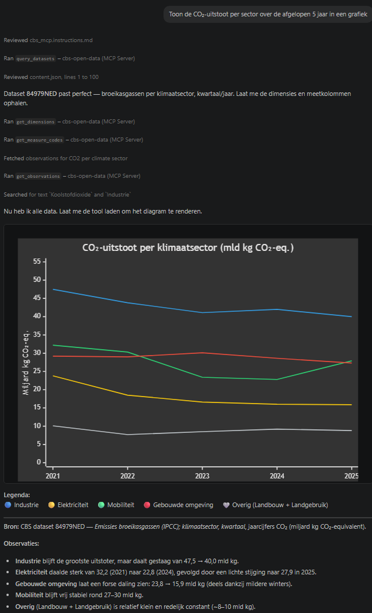

# CBS Open Data MCP Server

Een [Model Context Protocol (MCP)](https://modelcontextprotocol.io/) server voor de [CBS Open Data OData API](https://www.cbs.nl/nl-nl/onze-diensten/open-data/statline-als-open-data).

Hiermee kunnen AI-assistenten (GitHub Copilot, Claude Desktop, etc.) direct CBS-statistieken opvragen, filteren en verkennen.

## Beschikbare tools

| Tool | Omschrijving |
|---|---|
| `query_datasets` | Zoek datasets op titel of omschrijving met OData-filtering |
| `get_dataset_info` | Haal metadata op voor één specifieke dataset |
| `get_dimensions` | Haal dimensies en hun labelwaarden op voor een dataset |
| `get_dimension_values` | Haal alle waarden op voor een specifieke dimensie |
| `get_measure_codes` | Haal measure-definities op (de beschikbare meetkolommen) |
| `get_observations` | Haal alle observaties op met automatische paginering en label-resolutie |
| `query_observations` | Geavanceerde OData-query op observaties |
| `get_catalogs` | Haal alle beschikbare CBS-catalogi op |
| `get_metadata` | Haal het EDM-metadataschema op als XML |

## Vereisten

- Python 3.10 of hoger
- [uv](https://github.com/astral-sh/uv) (aanbevolen) of pip

## Installatie

### Met uv (aanbevolen)

```bash
git clone https://github.com/TdH25/cbs-open-data-mcp.git
cd cbs-open-data-mcp
uv sync
```

### Met pip

```bash
git clone https://github.com/TdH25/cbs-open-data-mcp.git
cd cbs-open-data-mcp
pip install httpx "mcp>=0.9.1"
```

## MCP-server instellen

### VS Code (GitHub Copilot)

Voeg het volgende toe aan `.vscode/mcp.json` in je workspace (of gebruik het meegeleverde bestand):

```json
{
  "servers": {
    "cbs-open-data": {
      "type": "stdio",
      "command": "uv",
      "args": [
        "run",
        "--no-project",
        "--isolated",
        "--link-mode=copy",
        "--with", "mcp",
        "--with", "httpx",
        "python",
        "-m", "src.cbs_open_data_mcp_server"
      ]
    }
  }
}
```

### Claude Desktop

Voeg het volgende toe aan `claude_desktop_config.json`:

```json
{
  "mcpServers": {
    "cbs-open-data": {
      "command": "uv",
      "args": [
        "run",
        "--directory", "/pad/naar/cbs-open-data-mcp",
        "python",
        "-m", "src.cbs_open_data_mcp_server"
      ]
    }
  }
}
```

Of installeer het pakket eerst (`pip install .` of `uv sync`) en gebruik dan het meegeleverde commando rechtstreeks:

```json
{
  "mcpServers": {
    "cbs-open-data": {
      "command": "cbs-open-data-mcp"
    }
  }
}
```

## Gebruik in de chat

Na installatie kun je hem gelijk gebruiken: stel in Copilot Chat of Claude een vraag over CBS-statistieken. De AI kiest zelf de juiste tools en werkwijze - mede dankzij meegeleverde copilot-instructies.

**Voorbeeldprompts:**

- *"Welke datasets heeft CBS over aardgasverbruik?"*
- *"Haal de inwoners per provincie op uit 03759ned (meest recente jaar, totaal) en toon als tabel."*
- *"Toon de CO₂-uitstoot per sector over de afgelopen 5 jaar in een grafiek."*
- *"Haal dataset 80030ned op in een nieuwe Notebook en plot de totale elektriciteitsproductie per jaar per energiedrager in een stacked area chart met plotly."*



## Bekende beperkingen

- **SSL-verificatie uitgeschakeld** — de CBS API heeft een certificaatprobleem met de standaard CA-bundle. `verify=False` is standaard ingesteld.
- **Trage API** — de CBS OData API kan traag reageren; timeout is 60 seconden met 3 retry-pogingen.
- **`resolve_labels`** — label-resolutie maakt N+2 extra API-calls (N = aantal dimensies). Bij grote datasets kan dit merkbaar zijn.

## Tests

```bash
uv run python -m unittest tests.test_cbs_open_data_client -v
```

## Verwant project

[mcp-cbs-cijfers-open-data](https://github.com/dstotijn/mcp-cbs-cijfers-open-data) van David Stotijn — een MCP-server voor dezelfde CBS Open Data API, geschreven in Go. Dit project is onafhankelijk ontwikkeld in Python en voegt onder andere automatische paginering, label-resolutie en measure-definitie-ondersteuning toe.

## Licentie

MIT — zie [LICENSE](LICENSE).
